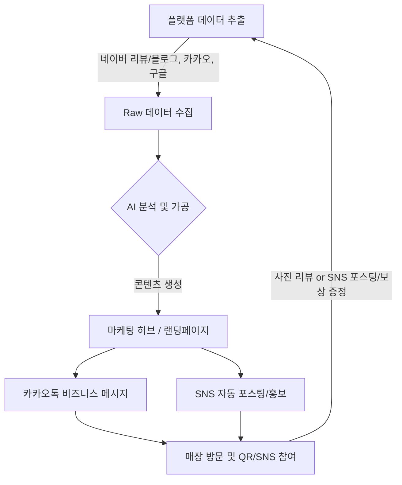

# 한마음 식당 마케팅 자동화 사전 검토 기획안

본 기획안은 '한마음 식당'의 온라인 브랜드 인지도를 높이고 고객 응대를 효율화하기 위한 마케팅 자동화 전략을 담고 있습니다. 특히, **고급 프론트엔드 디자인(Frontend Design)** 및 **성능 최적화(Vercel Best Practices)** 기술을 적용하여 실사용자가 체감할 수 있는 프리미엄 서비스를 구축합니다.

---

## 1. 리뷰 데이터 수집 및 콘텐츠 가공 프로세스

고객의 방문 경험을 데이터화하여 마케팅 자산으로 활용하기 위한 워크플로우를 설계합니다.

### 🔄 데이터 흐름도

### 📋 상세 프로세스
1.  **수집 (Ingestion):** 네이버(리뷰+블로그), 카카오맵, **구글 리뷰** 데이터를 주기적으로 수집합니다. (주요 항목: 평점, 텍스트, 작성일, 블로그 제목/본문 등)
2.  **가공 (Processing):** 
    -   **GPT 기반 감성 분석:** 리뷰 텍스트에서 긍정/부정을 분류하고 핵심 키워드('맛', '청결', '서비스', '오삼불고기')를 추출합니다.
    -   **콘텐츠 전략 (Content Strategy Skill 적용):**
        -   **Searchable (검색형):** 네이버/구글 블로그 포스팅용. "OO동 직장인 점심 추천", "단체 회식하기 좋은 곳" 등 *지역 검색 의도(Search Intent)*에 맞춘 정보성 문구 생성.
        -   **Shareable (공유형):** 인스타그램/SNS용. "7첩 반찬의 정성", "불향 덮인 제육볶음" 등 시각적 자극과 스토리텔링 중심의 확산형 마케팅 копи 생성.
3.  **활용 (Activation - 사용자 체감 단계):** 
    -   **카카오톡 실제 발송**: 수집된 베스트 리뷰와 AI 문구를 실제 알림톡/친구톡으로 발송하는 모듈 구축.
    -   **인스타그램/SNS 연동**: Playwright를 이용한 SNS 자동 포스팅 스크립트 또는 공유 전용 이미지 형태의 콘텐츠 생성.
    -   **[NEW] 고객용 모바일 랜딩페이지 (Premium UI/UX)**: 
        -   **디자인 전략 (Frontend Design Skill)**: '따뜻한 집밥' 감성의 프리미엄 타이포그래피와 모션 적용 (Branding).
        -   **접근성 및 성능 (Web Design & Vercel Skills)**: 모바일 최적화 및 이미지 지연 로딩(LCP 최적화)을 통한 쾌속 접속 환경 제공.
        -   **이미지 큐레이션**: 실제 리뷰 사진을 배치하여 시각적 신뢰도 확보.
        -   **성과 추적 로직**: "카카오 보고 왔어요" 시 서비스 제공 문구 포함.
    -   **[NEW] 매장 내 QR & SNS 참여 스테이션**: 
        -   **QR 코드 비치**: 테이블/계산대에 "사진 리뷰 쓰고 음료수 받자!" QR 코드 배치.
        -   **SNS 포스팅 보상**: 인스타그램/블로그에 필수 해시태그와 함께 포스팅 시 즉각적인 보상(음료 or 할인) 제공 안내. (안내 문구: "SNS에 예쁜 사진 올리고 직원에게 보여주세요!")
        -   **리뷰 데이터 환환**: 현장에서 확보된 '사진 리뷰' 및 '고객 SNS 게시글'들이 다음 날의 수집 데이터가 되어 마케팅 문구로 재탄생하는 선순환 구조 완성.

---

## 2. 카카오톡 스마트 채팅 자동 응대 설계

고객이 자주 묻는 질문에 즉각 대응하고, 식당의 강점을 어필할 수 있는 구조를 설계합니다.

### 🌳 채팅 트리(메뉴 뎁스) 구조
-   **[Main] 한마음 식당에 오신 것을 환영합니다!**
    -   **1. 메뉴 안내 🍱**
        -   점심 특선 (제육, 불고기, 찌개류)
        -   저녁 안주 (삼겹살, 백숙, 닭볶음탕)
    -   **2. 위치 및 주차 📍**
        -   주소 및 지도 링크
        -   주차 가능 여부 및 인근 주차장 안내
    -   **3. 솔직 이용 후기 ⭐**
        -   네이버/카카오 실제 방문자 리뷰 요약
        -   최신 베스트 리뷰 보기
    -   **4. 예약 및 문의 📞**
        -   **매장 전화 바로 연결**: 단체 예약 및 상세 문의 최우선 대응
        -   단체 예약 안내 (인원, 시간, 메뉴 사전 협의 등)

### 텍스트 초안 (Tone & Manner: 친절하고 정겨운 동네 맛집)
> **[웰컴 메시지]**
> "안녕하세요! 정성 가득한 집밥의 따뜻함을 전하는 '한마음 식당'입니다. 😊
> 매일 정갈하게 준비하는 밑반찬과 든든한 한 끼를 준비하고 있습니다. 궁금하신 점은 아래 메뉴를 선택해 주세요!"
>
> **[메뉴 안내 - 점심]**
> "한마음 식당의 자존심! 단골들이 인정하는 점심 메뉴입니다.
> - 불향 가득 제육볶음 (9.0)
> - 밥도둑 오삼불고기 (10.0)
> - 매칭 100% 김치/된장찌개 (8.0)
> *매일 바뀌는 정갈한 7첩 반찬이 함께 제공됩니다!"

---

## 3. 기술적 리스크 및 대응 방안

자동화 시스템 구축 시 발생할 수 있는 잠재적 문제와 해결책입니다.

| 리스크 항목 | 내용 | 대응 방안 (Mitigation) |
| :--- | :--- | :--- |
| **데이터 중복/스팸** | 동일 리뷰가 여러 플랫폼에 중복 노출됨 | 콘텐츠 해시(Hash) 기반의 중복 제거 로직 적용   (동일인, 동일 내용 필터링) |
| **플랫폼 UI 변경** | 수집기(Scraper) 작동 불능 | 주 1회 '수집기 헬스 체크' 자동 가동 및 장애 알림 설정 |
| **모바일 UX 미흡** | 랜딩페이지 가독성 저하 | 모바일 퍼스트 디자인(Responsive) 및 다기기 교차 검증 |

---

## 4. 운영 및 배포 가이드 (Operation Guide)
본 시스템은 다음과 같이 주기적으로 운영할 것을 권장합니다.

1.  **일일 자동 실행 (Daily Automation)**
    -   `npm start`를 Windows 작업 스케줄러(Task Scheduler) 또는 Linux Cron에 등록하여 매일 오전 9시에 전날의 리뷰를 수집 및 분석합니다.
2.  **리포트 모니터링**
    -   `reports/` 폴더에 생성되는 `summary_YYYY-MM-DD.md` 파일을 통해 신규 리뷰 현황과 AI가 제안한 마케팅 소구점을 정기적으로 확인합니다.
3.  **메시지 발송 승인**
    -   `kakao_bridge.ts`를 통해 생성된 메시지 초안을 검토 후, 실제 카카오 비즈니스 관리자 센터에서 고객들에게 발송합니다.

> [!IMPORTANT]
> **시스템 구축 완료**: 기획안에 명시된 모든 데이터 파이프라인(수집-분석-CS 연동-리포팅)의 구축이 완료되었습니다. 현재 `npm start` 명령어로 즉시 통합 가동이 가능합니다.
